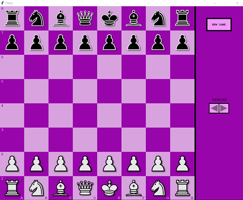
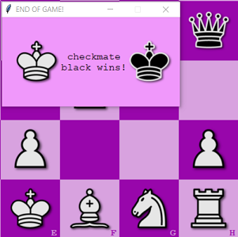

# Python Graphic Chess Application


## General info
This project is chess application. Two users can play chess locally on the same device.

## Technologies
Project is created with:
* Python 3.9.6
* Graphics.py module
* PyInstaller (used to bundle application into executable file)

## Implemented features:
- game controlled by mouse
- standard chess moves (moving, taking, castling, en passant)
- displaying all possible moves
- not displaying illegal moves i.e. moving over pieces (does not apply to knight) and moves that will allow current player's king to be taken in next move by enemy player
- denying rights to castle (if king or rook have been moved)
- handling all possible game ends scenarios i.e. checkmate, stalemate, threefold repetition, insufficient material, fifty-move rule
- displaying previous states of the game (rewinding moves)
- restoring previous states of the game (game will be continued from chosen previous state)
- starting new game
- action sounds
- popping window at the end of the game:




## Setup
* Option 1 - Download [EXE file](Chess_EXE_file/Chess-App.zip), extract all files, then run ```chess_main.exe```. Now you can start playing!
* Option 2 - Download repository and run chess_main.py using Python.


