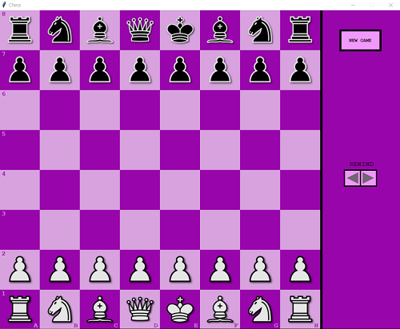
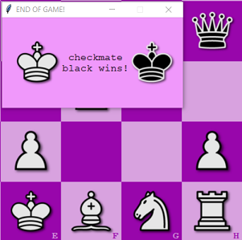

@mainpage Overview
@tableofcontents

@attention Lacking full documentation for Buttons

@authors
  Karol Płonka,
  Michał Szymański
@date Dec 19, 2022

# Python Graphic Chess Application

 

## General info
This project is chess application. Two users can play chess locally on the same device.

 

## Technologies
Project is created with:
* Python 3.9.6
* Graphics.py module
* PyInstaller (used to bundle application into executable file)

 

## Implemented features:
- game controlled by mouse
- standard chess moves (moving, taking, castling, en passant)
- displaying all possible moves
- not displaying illegal moves i.e. moving over pieces (does not apply to knight) and moves that will allow current player's king to be taken in next move by enemy player
- denying rights to castle (if king or rook have been moved)
- handling all possible game ends scenarios i.e. checkmate, stalemate, threefold repetition, insufficient material, fifty-move rule
- displaying previous states of the game (rewinding moves)
- restoring previous states of the game (game will be continued from chosen previous state)
- starting new game
- action sounds
- popping window at the end of the game:

 

 

## Setup
* Option 1 - Download <a href="../Chess.zip" download>Chess.zip</a>, extract all the files. Now you can start playing!
* Option 2 - Download Github the repository <a href="https://github.com/KarolPlonka/Python-Chess-App" download>github.com/KarolPlonka/Python-Chess-App</a> and run chess_main.py using Python.

